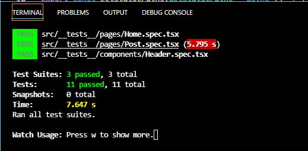

<h1 align="center">Ignite: Desafio 05 - Criando um projeto do zero.</h1>

Neste desafio, o objetivo principal é criar um blog do zero utilizando o Prismic e interface com base no layout disponibilizado no Figma. Além disso, deve-se aplicar alguns conceitos do NextJS aprendidos no Chapter III do Ignite.

## :sparkler: Aplicação

## :white_check_mark: Testes

